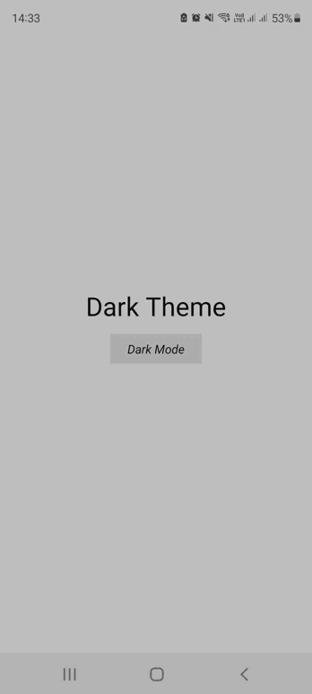

<h1>DarkTheme</h1>

<h1>Sobre o projeto</h1>

Este é o app DarkTheme, que tem como intenção mudar o tema da sua aplicação para o modo escuro ou claro através das configurações do seu celular.

<h1>Configurações</h1>

<ul>
<li>O app foi desenvolvido totalmente com o Expo. Link: <a href='https://docs.expo.dev/'>https://docs.expo.dev/</a></li>
<li>Para a aplicação rodar é necessário realizar o comando: Expo Start</li>
<li>Não se esqueça de realizar o comando: Yarn Install ou Npm Install. Sem eles o projeto não irá funcionar</li>
</ul>

Obrigado por acessar este repositório e bom desenvolvimento!

